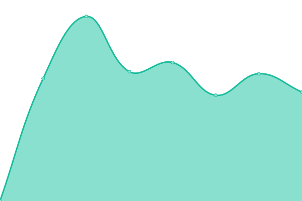

# [📈 Live Status](https://AlexGuada.github.io/upptime): <!--live status--> **🟧 Partial outage**

This repository contains the open-source uptime monitor and status page for [Alessio Guadagno](https://AlexGuada.github.io/upptime), powered by [Upptime](https://github.com/upptime/upptime).

With [Upptime](https://upptime.js.org), you can get your own unlimited and free uptime monitor and status page, powered entirely by a GitHub repository. We use [Issues](https://github.com/AlexGuada/upptime/issues) as incident reports, [Actions](https://github.com/AlexGuada/upptime/actions) as uptime monitors, and [Pages](https://AlexGuada.github.io/upptime) for the status page.

<!--start: status pages-->
<!-- This summary is generated by Upptime (https://github.com/upptime/upptime) -->
<!-- Do not edit this manually, your changes will be overwritten -->
<!-- prettier-ignore -->
| URL | Status | History | Response Time | Uptime |
| --- | ------ | ------- | ------------- | ------ |
|  AXG-DE1 | 🟥 Down | [axg-de-1.yml](https://github.com/AlexGuada/upptime/commits/HEAD/history/axg-de-1.yml) | 

 1293ms
     
 | 

<a href="https://sts.alessio-guadagno.it/history/axg-de-1">99.92%</a>
    

|  AXG-FR1 | 🟩 Up | [axg-fr-1.yml](https://github.com/AlexGuada/upptime/commits/HEAD/history/axg-fr-1.yml) | 

 1885ms
     
 | 

<a href="https://sts.alessio-guadagno.it/history/axg-fr-1">99.93%</a>
    

|  AXG-UK1 | 🟩 Up | [axg-uk-1.yml](https://github.com/AlexGuada/upptime/commits/HEAD/history/axg-uk-1.yml) | 

 604ms
     
 | 

<a href="https://sts.alessio-guadagno.it/history/axg-uk-1">100.00%</a>
    

<!--end: status pages-->

## 📄 License

- Powered by: [Upptime](https://github.com/upptime/upptime)
- Code: [MIT](./LICENSE) © [Alessio Guadagno](https://AlexGuada.github.io/upptime)
- Data in the `./history` directory: [Open Database License](https://opendatacommons.org/licenses/odbl/1-0/)
